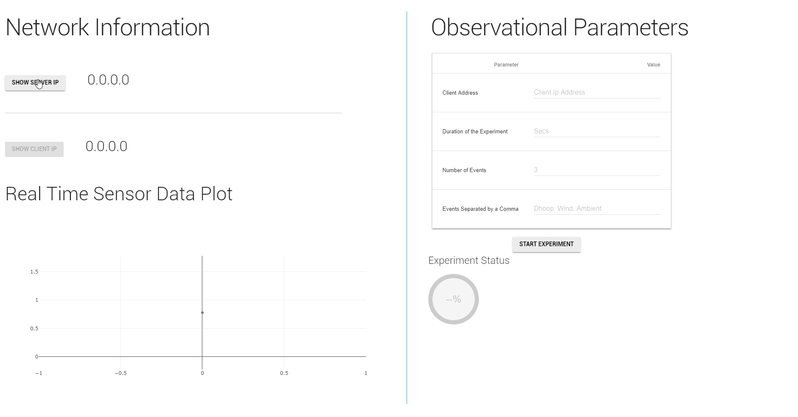

# AUM-Gui-Client 
- A desktop dashboard for AUM Demo(s)
- Built on Electron 🎇 and :snake: Python!

## AUM
AUM is a photonic systems research project that aims to deliver various gas parameters

## Demo


## To Use

To clone and run this repository you'll need [Git](https://git-scm.com) and [Node.js](https://nodejs.org/en/download/) (which comes with [npm](http://npmjs.com)) installed on your computer. From your command line:

```bash
# Clone this repository
# Go into the repository
cd _whatevername_
# Install dependencies
npm install
# Run the app
npm start
```

## License

[CC0 1.0 (Public Domain)](LICENSE.md)
